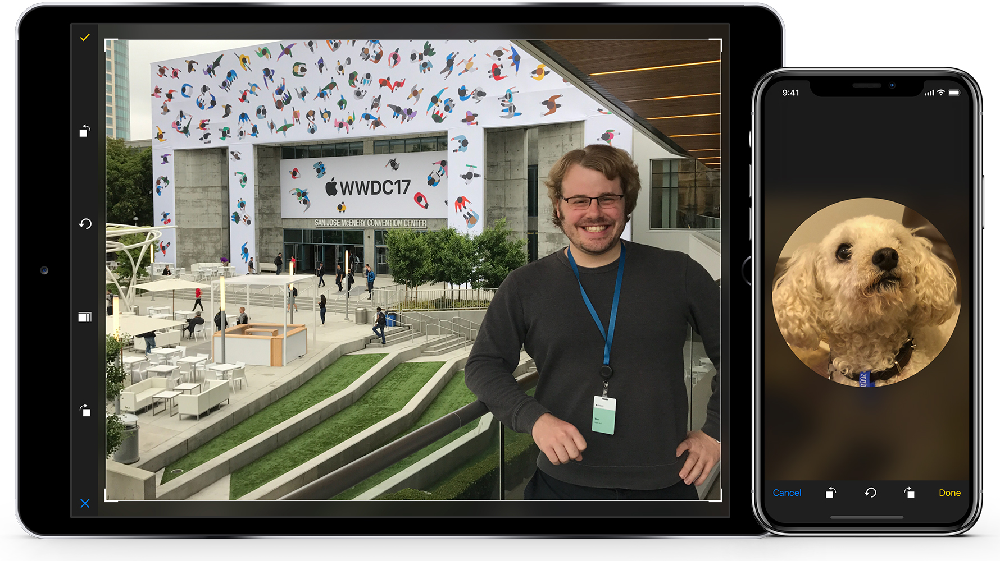
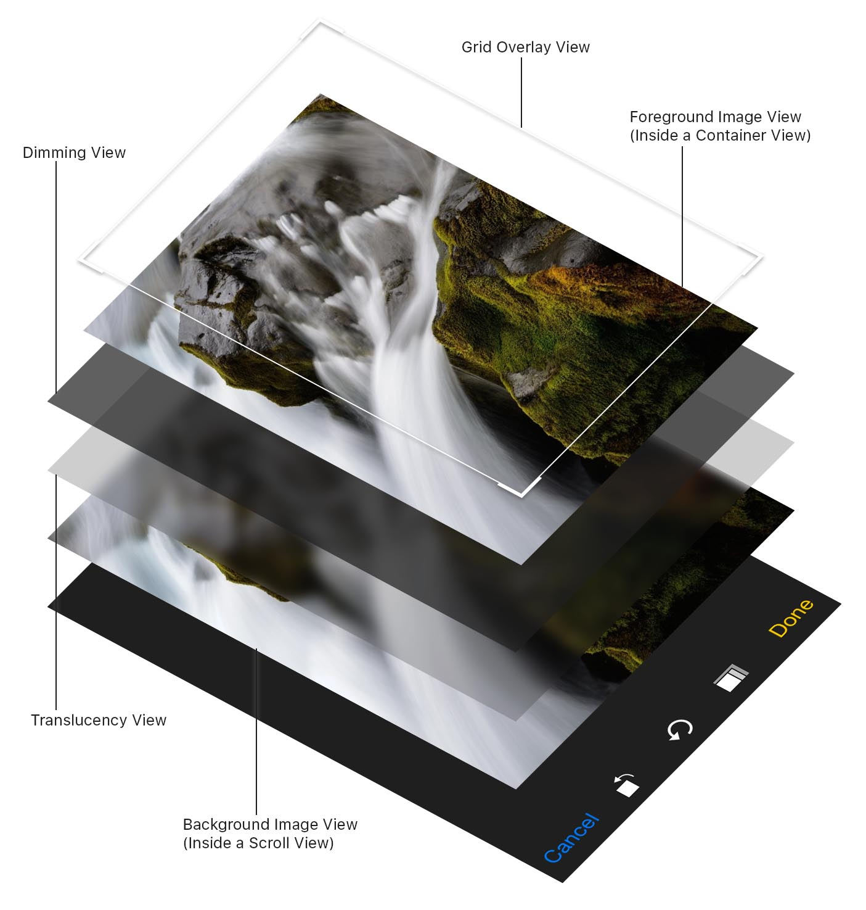

# TOCropViewController



[](http://api.travis-ci.org/TimOliver/TOCropViewController.svg)
[](http://cocoadocs.org/docsets/TOCropViewController)
[](http://cocoadocs.org/docsets/TOCropViewController)
[](http://cocoadocs.org/docsets/TOCropViewController)

TOCropViewController is an open-source `UIViewController` subclass built to allow users to perform basic manipulation on UIImage objects; specifically cropping and some basic rotations. It has been designed with the iOS 8 Photos app in mind, and as such, behaves in an already familiar way.

## Features
* Crop images by dragging the edges of a grid overlay.
* Rotate images in 90-degree segments.
* Clamp the crop box to a specific aspect ratio.
* A reset button to completely undo all changes.
* iOS 7/8 translucency to make it easier to view the cropped region.
* The choice of having the controller return the cropped image to a delegate, or immediately pass it to a `UIActivityViewController`.
* A custom animation and layout when the device is rotated to landscape mode.
* Custom 'opening' and 'dismissal' animations.
* Localized in 14 languages.

## Technical Requirements
iOS 7.0 or above.

## Installation

### [Cocoapods](https://cocoapods.org/)

``` ruby
pod 'TOCropViewController'
```

### Manual

Add the files in the TOCropViewController subfolder to your Xcode project.

## How does it work?
While traditional cropping UI implementations will usually just have a dimming view with a square hole cut out of the middle, `TOCropViewController` goes about its implementation a little differently.



Since there are two views that are overlaid over the image (A dimming view and a translucency view), trying to cut a hole open in both of them would be rather complex. Instead, an image view is placed in a scroll view in the background, and a copy of the image view is placed on top, inside a container view that is clipped to the designated cropping size. The size and position of the foreground image is then made to match the background view, creating the illusion that there is a hole in the dimming views, and minimising the number of views onscreen.

## License
TOCropViewController is licensed under the MIT License, please see the LICENSE file.